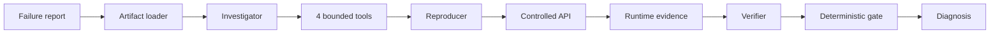

# TraceRoot

TraceRoot is a bounded agentic API failure investigator that turns a failure report into source evidence, a controlled reproduction, and an independently verified diagnosis.

> **Official evaluation:** 23/24 agentic runs reached evidence-backed verification · 0 unsupported positive claims · 48/48 evaluation slots completed · 0 fairness issues

The one-shot baseline has no runtime verification capability by design. The 95.8% verification result is therefore **not** a direct accuracy uplift over baseline, and TraceRoot did not consistently improve strict static localization accuracy in this benchmark.

## Demo

Watch the TraceRoot demo on YouTube:
[https://youtu.be/-OdVg0Ldw_Q](https://youtu.be/-OdVg0Ldw_Q)

## Result highlights

Run the representative case-004 investigation:

```sh
npm run demo
```

The concise output calls out case loading, evidence inspection, hypothesis formation, controlled reproduction, Verifier outcome, final status, and LLM/tool/token counts. It uses the frozen workflow and makes real OpenAI API calls, so configure credentials first.

Measured across eight cases × two modes × three repetitions:

| Metric | One-shot baseline | TraceRoot agentic |
|---|---:|---:|
| All root-cause fields | 87.5% | 83.3% |
| Evidence-verified | N/A | 95.8% (23/24) |
| Unsupported positive claims | 0.0% | 0.0% |
| Mean LLM calls / tools | 1.00 / 0.00 | 6.17 / 3.08 |
| Mean tokens / runtime | 4,106 / 4.9 s | 22,525 / 30.6 s |

TraceRoot’s measured advantage is runtime-grounded diagnosis, not a demonstrated increase in overall static accuracy. See the [full evaluation report](docs/evaluation-report.md).

## Why this problem matters

Backend failures rarely identify their own cause. A loud log can be secondary, a configuration value can lose through precedence, and a TypeScript assertion can disagree with runtime input. A one-shot LLM can propose a plausible explanation, but it cannot establish that the reported request follows that causal path. TraceRoot makes the investigation auditable and can abstain when evidence remains insufficient.

## Architecture



The orchestrator—not the model—controls budgets, allowed actions, tool execution, state transitions, and verification prerequisites. Only these tools exist:

- `search_source`
- `read_source`
- `search_logs`
- `execute_reproduction`

There is no shell tool, unrestricted filesystem/network access, database, vector store, or frontend. The [architecture guide](docs/architecture.md) shows the model/ground-truth isolation boundary.

## Quick start

Requirements: Node.js 22 or newer and npm.

```sh
npm ci
npm run typecheck
npm test
npm run build
```

For a real investigation on macOS/Linux:

```sh
export OPENAI_API_KEY="..."
export OPENAI_MODEL="gpt-5.6-sol"
npm run investigate -- case-001
```

Windows PowerShell:

```powershell
$env:OPENAI_API_KEY = "..."
$env:OPENAI_MODEL = "gpt-5.6-sol"
npm run investigate -- case-001
```

Credentials are read only from environment variables and are redacted from saved artifacts. Never commit `.env`.

## Example investigation

Case-004 reports that looking up an existing account by external ID returns HTTP 500. TraceRoot:

1. reads the account handler and shared application data;
2. forms a hypothesis that the predicate compares `externalId` against the internal `id` field;
3. reproduces the required GET/path/status/body signature on a reset target;
4. captures correlated runtime logs;
5. verifies that a louder audit failure is secondary and does not select the response branch;
6. returns `verified` with limitations and zero unsupported positive claims.

The sanitized completed trajectory is [case-004-r1.json](submission/trajectories/case-004-r1.json).

## Benchmark results

The frozen evaluation used eight deterministic cases, the same artifact bundle and model for both modes, and three repetitions. Every source allowlist contains the same five files. Execution completed before hidden ground truth was loaded for exact scoring.

Baseline category/source/symbol/all-field accuracy was 87.5% / 100% / 100% / 87.5%. Agentic accuracy was 91.7% / 91.7% / 91.7% / 83.3%. One agentic run stopped `evidence_insufficient_after_max_rounds` instead of forcing verification. Category and location ontology limitations are documented for case-005 and case-002 rather than retroactively changing the benchmark.

- [Human-readable report](docs/evaluation-report.md)
- [Submission-safe evaluation JSON](docs/evaluation-summary.json)
- [Sanitized representative trajectories](submission/trajectories/README.md)

## Reproducibility

Evaluation is a dry run unless `--execute` is explicitly supplied:

```sh
npm run evaluate:all -- --repetitions 3
```

The dry run makes zero provider calls. This command does make real API calls and incurs cost:

```sh
npm run evaluate:all -- --repetitions 3 --execute
```

Do not rerun the frozen official results unless intentionally conducting a new experiment. Follow the [clean-clone validation procedure](docs/reproducibility.md) for install, typecheck, tests, build, fake-provider investigation, and zero-credit evaluation planning.

## Security and isolation

`ArtifactLoader` exposes only the public failure report, permitted source files, and initial public logs. The reusable path sandbox denies traversal, absolute-path escape, symlink escape, hidden ground truth, internal runtime mappings, results, unrelated paths, and oversized reads. Stable hashes bind every run to its exact public inputs.

`execute_reproduction` is the only component permitted to call target reset/control/log endpoints. It resets deterministic state, creates a request correlation ID, executes one validated HTTP request, gathers correlated logs, and compares required versus supporting assertions. Hidden ground truth is evaluator-only.

## Limitations

- Eight controlled cases are smaller and simpler than production incident distributions.
- Only one model family was evaluated.
- Exact categories and source ownership can overlap across adjacent components.
- Agentic runs used roughly 5.5× more tokens and 6.2× more time.
- Verification establishes the benchmark failure path; it does not test a patch or prove production-wide generality.
- Model output can vary even with the same effective sampling configuration.

## Project structure

```text
cases/public/              model-visible reports and initial logs
cases/internal/            runtime mappings (model-inaccessible)
cases/ground-truth/        evaluator-only answers
src/artifacts/             immutable loader and hashing
src/security/              filesystem sandbox
src/tools/                 four bounded tool contracts
src/baseline/              frozen one-shot comparison
src/agentic/               roles, state machine, gate, trajectories
src/target-api/            deterministic controlled Express API
src/evaluation/            isolated scheduling and exact scoring
src/submission/            submission-safe packaging only
tests/                     deterministic and regression coverage
docs/                      architecture, evaluation, reproducibility
submission/                sanitized trajectories and contest copy
```

## Hackathon methodology

Development proceeded in frozen phases: deterministic benchmark infrastructure, bounded tools/provider abstraction, a one-shot baseline, leakage hardening, agentic workflow, and isolated evaluation. Real credentialed smoke tests exposed provider response-shape, model-capability, strict JSON Schema, schema-alignment, budget-context, reproduction-semantics, and unsupported-claim defects. Each was fixed at the responsible layer and regression-tested before the official evaluation.

Frozen versions:

```text
baseline-v2
investigator-v1
reproducer-v2
verifier-v2
agentic-trajectory-v3
tool contract 1.1.0
agentic-result-v1
human-review-set-v2
```

The [improvement changelog](IMPROVEMENT_CHANGELOG.md) records the evidence behind those changes. The [submission checklist](submission/agent-trajectory-checklist.md) distinguishes TraceRoot runtime trajectories from the actual Codex development-session exports required separately by the hackathon.
