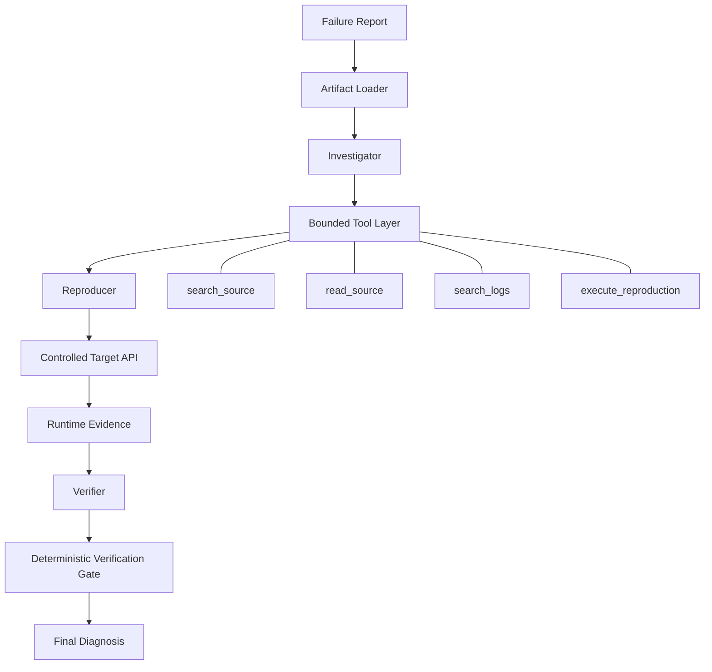
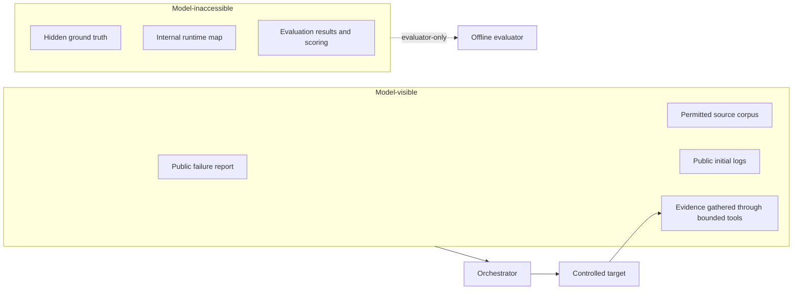

# TraceRoot architecture

TraceRoot separates probabilistic reasoning from deterministic authority. Models propose what to inspect, hypothesize, reproduce, and verify; the orchestrator enforces the state machine and the four-tool boundary.

The sequence is not a free-form model loop. Source/log actions execute only through allowlisted artifact-backed tools. The Reproducer can describe an HTTP request, but runtime code validates it and `execute_reproduction` alone may reset and contact the controlled target.

## Isolation boundary

`ArtifactLoader` constructs the same immutable public bundle for baseline and agentic modes. Its filesystem sandbox denies traversal, symlink escape, hidden ground truth, internal runtime mappings, generated results, unrelated paths, and oversized reads. Evaluation loads hidden truth only after candidate execution has completed.

## Deterministic control plane

The orchestrator—not the model—controls:

- investigation, reproduction, tool-call, and token budgets;
- allowed next actions derived from current state;
- validation and execution of all tool calls;
- hypothesis revision and experiment recording;
- state transitions between Investigator, Reproducer, and Verifier;
- whether required reproduction assertions passed;
- final verification prerequisites and termination reasons.

This design prevents a model from granting itself capabilities, redefining the reported failure signature, claiming nonexistent budget exhaustion, or self-awarding `verified`.

## Baseline comparison

The one-shot baseline uses the same public artifact loader but bypasses the tool/state-machine path. It receives every permitted artifact in a canonical serialization, makes one reasoning call, and emits the shared diagnosis schema with status `unverified` or `inconclusive`. Its inability to verify is an experimental constraint, not an implementation omission.
